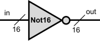
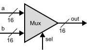

# 16 Bits Variants

## Not16 gate

API description:

	Chip name: Not16
	Input: in[16]
	Output: out[16]
	Function (JS):	for( let i = 0; i < 16; i++) {
						if( out[i] = 1 ) {
							out[i] = 0;
						} else {
							out[i] = 1;
						}
					}

### Construction of new Not16 gate:

The overall construction as simple as the gathering of 16 equal NOT gates.

.svg)

Writing description in HDL code (Not16.hdl):

    CHIP Not16 {
    	IN in[16];
    	OUT out[16];

    PARTS:
		Not(in=in[0], out=out[0]);
		Not(in=in[1], out=out[1]);
		Not(in=in[2], out=out[2]);
		Not(in=in[3], out=out[3]);
		Not(in=in[4], out=out[4]);
		Not(in=in[5], out=out[5]);
		Not(in=in[6], out=out[6]);
		Not(in=in[7], out=out[7]);
		Not(in=in[8], out=out[8]);
		Not(in=in[9], out=out[9]);
		Not(in=in[10], out=out[10]);
		Not(in=in[11], out=out[11]);
		Not(in=in[12], out=out[12]);
		Not(in=in[13], out=out[13]);
		Not(in=in[14], out=out[14]);
		Not(in=in[15], out=out[15]);
}

Hardware Simulator 2.5 script test to check complience with truth table for NOT16 gate - SUCCESSFUL!

## New Not16 gate

## And16 gate

API description:

	Chip name: And16
	Input: a[16], b[16]
	Output: out[16]	
	Function (JS):	for( let i = 0; i < 16; i++) {
						if ( (a[i]==1) && (b[i]==1) ) {
                        	out[i] = 1;
						} else {
                        	out[i] = 0;
                    	}
					}

### Construction of new And16 gate:

Construction as simple as building of 16 AND gates and connect each to the corresponding input of buses a, b and out:

.svg)

Writing description in HDL code (And16.hdl):

    CHIP And16 {
        IN a[16], b[16];
        OUT out[16];
    PARTS:
        And(a=a[0], b=b[0], out=out[0]);
	    And(a=a[1], b=b[1], out=out[1]);
	    And(a=a[2], b=b[2], out=out[2]);
	    And(a=a[3], b=b[3], out=out[3]);
	    And(a=a[4], b=b[4], out=out[4]);
	    And(a=a[5], b=b[5], out=out[5]);
	    And(a=a[6], b=b[6], out=out[6]);
	    And(a=a[7], b=b[7], out=out[7]);
	    And(a=a[8], b=b[8], out=out[8]);
	    And(a=a[9], b=b[9], out=out[9]);
	    And(a=a[10], b=b[10], out=out[10]);
	    And(a=a[11], b=b[11], out=out[11]);
	    And(a=a[12], b=b[12], out=out[12]);
	    And(a=a[13], b=b[13], out=out[13]);
	    And(a=a[14], b=b[14], out=out[14]);
	    And(a=a[15], b=b[15], out=out[15]); 	
    }

Hardware Simulator 2.5 script test to check complience with truth table for AND16 gate - SUCCESSFUL!

## New And16 gate

## Or16 gate

API description:

	Chip name: Or16
	Input: a[16], b[16]
	Output: out[16]
	Function (JS):	for( let i = 0; i < 16; i++) {
						if ( (a==0) && (b==0) ) {
                        	out = 0;
                    	} else {
                        	out = 1;
                    	}
					}

### Construction of new Or16 gate:

Construction as simple as building of 16 OR gates and connect each to the corresponding input of buses a, b and out:

.svg)

Writing description in HDL code (Or16.hdl):

	CHIP Or16 {
    	IN a[16], b[16];
    	OUT out[16];

    PARTS:
		Or(a=a[0], b=b[0], out=out[0]);
		Or(a=a[1], b=b[1], out=out[1]);
		Or(a=a[2], b=b[2], out=out[2]);
		Or(a=a[3], b=b[3], out=out[3]);
		Or(a=a[4], b=b[4], out=out[4]);
		Or(a=a[5], b=b[5], out=out[5]);
		Or(a=a[6], b=b[6], out=out[6]);
		Or(a=a[7], b=b[7], out=out[7]);
		Or(a=a[8], b=b[8], out=out[8]);
		Or(a=a[9], b=b[9], out=out[9]);
		Or(a=a[10], b=b[10], out=out[10]);
		Or(a=a[11], b=b[11], out=out[11]);
		Or(a=a[12], b=b[12], out=out[12]);
		Or(a=a[13], b=b[13], out=out[13]);
		Or(a=a[14], b=b[14], out=out[14]);
		Or(a=a[15], b=b[15], out=out[15]);
	}

Hardware Simulator 2.5 script test to check complience with truth table for OR16 gate - SUCCESSFUL!

## New Or16 gate

## Mux16 gate

API description:

	Chip name: Mux16
	Input: a[16], b[16], sel
	Output: out[16]
	Function (JS):	if ( sel==0 ) {
						for( let i = 0; i < 16; i++) {
							out[i] = a[i];
						}
					} else {
						for( let i = 0; i < 16; i++) {
							out[i] = b[i];
						}
					}

### Construction of new Mux16 gate:

Construction as simple as building of 16 Mux gates and connect each to the corresponding input of buses a, b and out, while sel input is a common one for all 16 Mux gates:

.svg)

Writing description in HDL code (Mux16.hdl):

	CHIP Mux16 {
    	IN a[16], b[16], sel;
    	OUT out[16];

    PARTS:
    	Mux(a=a[0], b=b[0], sel=sel, out=out[0]);
		Mux(a=a[1], b=b[1], sel=sel, out=out[1]);
		Mux(a=a[2], b=b[2], sel=sel, out=out[2]);
		Mux(a=a[3], b=b[3], sel=sel, out=out[3]);
		Mux(a=a[4], b=b[4], sel=sel, out=out[4]);
		Mux(a=a[5], b=b[5], sel=sel, out=out[5]);
		Mux(a=a[6], b=b[6], sel=sel, out=out[6]);
		Mux(a=a[7], b=b[7], sel=sel, out=out[7]);
		Mux(a=a[8], b=b[8], sel=sel, out=out[8]);
		Mux(a=a[9], b=b[9], sel=sel, out=out[9]);
		Mux(a=a[10], b=b[10], sel=sel, out=out[10]);
		Mux(a=a[11], b=b[11], sel=sel, out=out[11]);
		Mux(a=a[12], b=b[12], sel=sel, out=out[12]);
		Mux(a=a[13], b=b[13], sel=sel, out=out[13]);
		Mux(a=a[14], b=b[14], sel=sel, out=out[14]);
		Mux(a=a[15], b=b[15], sel=sel, out=out[15]);
	}

Hardware Simulator 2.5 script test to check complience with truth table for MUX16 gate - SUCCESSFUL!

## New MUX16 gate

