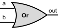

# Elementary Logic Gates with NAND gate

## NAND gate

Truth table for NAND gate 
| a | b | out = NAND( a, b ) |
|:---:|:---:|:---:|
| 0 | 0 | 1 |
| 0 | 1 | 1 |
| 1 | 0 | 1 |
| 1 | 1 | 0 |

## Not gate

API description:

    Chip name: Not
    Input: in
    Output: out
    Function (JS):  if ( in == 0 ) {
                        out = 1;
                    } else {
                        out = 0;
                    }

Truth table for NOT gate 
| in | out = NOT( a ) |
|:---:|:---:|
| 0 | 1 |
| 1 | 0 |

Minding that NAND( x, y ) = NOT( x AND y )

Using monotone law for idempotence of logical conjunction operation AND for boolean expressions: *x* AND *x* = *x* [link](BooleanAlgebra.md)

Assuming y = x (In real life that means the same signal on both input ports), we have:

>NAND( x, x ) = NOT( x AND x ) = NOT( x )

### Construction of new Not gate:

Joining two intake ports (a and b) into single in port:

.svg)

Writing description in HDL code (Not.hdl):

    CHIP Not {
        IN in;
        OUT out;
    PARTS:
        Nand( a=in, b=in, out=out );
    }

Hardware Simulator 2.5 script test to check complience with truth table for NOT gate - SUCCESSFUL!

## New Not gate

## And gate

Truth table for AND gate 
| a | b | out = a AND b |
|:---:|:---:|:---:|
| 0 | 0 | 0 |
| 0 | 1 | 0 |
| 1 | 0 | 0 |
| 1 | 1 | 1 |

API description:

    Chip name: And
    Input: a, b
    Output: out
    Function (JS):  if ((a==1) && (b==1)) {
                        out = 1;
                    } else {
                        out = 0;
                    }

Minding that NAND( x, y ) = NOT( x AND y ) from previous example of NOT gate construction, and using nonmonotone law for double negation for boolean expressions NOT( NOT( x )) = x, we have: 

>NOT( NAND( x, y ) ) = NOT( NOT( x AND y ) ) = x AND y  

### Construction of new And gate:

Combining NAND and NOT gates:

.svg)

Writing description in HDL code (And.hdl):

    CHIP And {
        IN a, b;
        OUT out;
    PARTS:
        Nand( a=a, b=b, out=o1 );
        Not( in=o1, out=out );
    }

Hardware Simulator 2.5 script test to check complience with truth table for AND gate - SUCCESSFUL!

## New And gate

## Or gate

Truth table for OR gate 
| a | b | out = a OR b |
|:---:|:---:|:---:|
| 0 | 0 | 0 |
| 0 | 1 | 1 |
| 1 | 0 | 1 |
| 1 | 1 | 1 |

API description:

    Chip name: Or
    Input: a, b
    Output: out
    Function (JS):  if ((a==0) && (b==0)) {
                        out = 0;
                    } else {
                        out = 1;
                    }

Using De Morgan's law 1 is the only way to change operation from disjunction (OR) operation to conjunction (AND) operation, which gate we already constructed:

NOT( x ) AND NOT( y ) = NOT( x OR y ) [link](BooleanAlgebra.md)

We'll try to go backwards from disjunction (OR) operation to conjunction (AND) operation:

a OR b

Using reverse nonmonotone law for double negation for boolean expressions: x = NOT( NOT( x )) 

a OR b = NOT( NOT( a ) ) OR NOT( NOT( b ) )

Using De Morgan's 1 law:

NOT( NOT( a ) ) OR NOT( NOT( b ) ) = NOT( NOT( a ) AND NOT( b ) )

Such we have: 

>a OR b = NOT( NOT( a ) AND NOT( b ) )

### Construction of new Or gate:

.svg)

Writing description in HDL code (OR.hdl):

CHIP Or {
        IN a, b;
        OUT out;
    PARTS:
        Not( in=a, out=o1 );
        Not( in=b, out=o2 );
        And( a=o1, b=o2, out=o3 );
        Not( in=o3, out=out );
    }

Hardware Simulator 2.5 script test to check complience with truth table for OR gate - SUCCESSFUL!

## New Or gate

## Xor gate

Truth table for XOR gate 
| a | b | out = a XOR b |
|:---:|:---:|:---:|
| 0 | 0 | 0 |
| 0 | 1 | 1 |
| 1 | 0 | 1 |
| 1 | 1 | 0 |

API description:

    Chip name: Xor
    Input: a, b
    Output: out
    Function (JS):  if (a!=b) {
                        out = 1;
                    } else {
                        out = 0;
                    }

Let's write the logical equation representation of the truth table for XOR gate for all the states of the gate where output is true (1):

| a | b | out = a XOR b | |
|:---:|:---:|:---:|:---:|
| 0 | 1 | 1 | NOT( a ) AND  b |
| 1 | 0 | 1 | a AND NOT( b ) |

Let's combine the individual statements into one equation with the help of OR operator:

>( NOT( a ) AND  b ) OR ( a AND NOT( b ) )

### Construction of new Xor gate:

.svg)

Writing description in HDL code (XOR.hdl):

    CHIP Xor {
         IN a, b;
         OUT out;
    PARTS:
        Not(in=a, out=o1);
        And(a=o1, b=b, out=o2);
        Not(in=b, out=o3);
        And(a=o3, b=a, out=o4);
        Or(a=o2, b=o4, out=out);    	
    }

Hardware Simulator 2.5 script test to check complience with truth table for XOR gate - SUCCESSFUL!

## New Xor gate

## Mux gate

Truth table for MUX gate 
| a | b | sel | out |
|:---:|:---:|:---:|:---:|
| 0 | 0 | 0 | 0 |
| 0 | 1 | 0 | 0 |
| 1 | 0 | 0 | 1 |
| 1 | 1 | 0 | 1 |
| 0 | 0 | 1 | 0 |
| 0 | 1 | 1 | 1 |
| 1 | 0 | 1 | 0 |
| 1 | 1 | 1 | 1 |

API description:
    Chip name: Mux
    Input: a, b, sel
    Output: out
    Function (JS):  if (sel==0) {
                        out = a;
                    } else {
                        out = b;
                    }

Let's write the logical equation representation of the truth table for MUX gate for all the states of the gate where output is true (1) and combine them with OR operator to get the final logical representation in form of equation:

>( a AND NOT( b ) AND NOT( sel ) ) OR ( a AND b and NOT( sel ) ) OR ( NOT( a ) AND b AND sel ) OR ( a AND b AND sel )

### Constructing new Mux gate without optimization

Writing description in HDL code (Muxtmp.hdl):

    CHIP Muxtmp {
        IN a, b;
        OUT out;
    PARTS:
        Not(in=b, out=o1);
	    And(a=a, b=o1, out=o2);
	    Not(in=sel, out=o3);
	    And(a=o2, b=o3, out=o4);
	
    	And(a=a, b=b, out=o5);
	    Not(in=sel, out=o6);
	    And(a=o5, b=o6, out=o7);
		    Or(a=o4, b=o7, out=o8);
		Not(in=a, out=o9);
	    And(a=o9, b=b, out=o10);
	    And(a=o10, b=sel, out=o11);
		    Or(a=o8, b=o11, out=o12);
    	And(a=a, b=b, out=o13);
	    And(a=o13, b=sel, out=o14);
		    Or(a=o12, b=o14, out=out);  	
    }

Hardware Simulator 2.5 script test to check complience with truth table for MUX gate - SUCCESSFUL!

Howerver, this configuration is quite clumsy and has 4 NOT, 8 AND, and 3 OR gates. Let's review logical statement and try to simplify it.

>( a AND NOT( b ) AND NOT( sel ) ) OR ( a AND b and NOT( sel ) ) OR ( NOT( a ) AND b AND sel ) OR ( a AND b AND sel )

Distributivity of conjunction operation AND over disjunction operation OR:

x OR ( y AND z ) = ( x OR y ) AND ( x OR z ) [link](BooleanAlgebra.md)

Taking out ( a AND NOT( sel ) ) from first and second parts of the logical statement and ( b AND sel ) from third and forth part, we have:

>( ( a AND NOT( sel ) ) AND ( NOT( b ) OR b ) ) OR ( ( b AND sel ) AND ( NOT( a ) OR a ) )

Using nonemonotone low of complementation for operation: x OR NOT( x ) = 1 [link](BooleanAlgebra.md) we transform previous equation as follows:

> ( ( a AND NOT( sel ) ) AND 1 ) OR ( ( b AND sel ) AND 1 )

Using monotone low identity for conjucntion operation AND: x AND 1 = x we have:

> ( a AND NOT( sel ) ) OR ( b AND sel )

### Constructing new Mux gate with optimization

.svg)

Writing description in HDL code (Mux.hdl):

    CHIP Mux {
        IN a, b;
        OUT out;
    PARTS:
        Not(in=sel, out=o1);
	    And(a=a, b=o1, out=o2);
	    And(a=b, b=sel, out=o3);
		    Or(a=o2, b=o3, out=out);  	
    }

Hardware Simulator 2.5 script test to check complience with truth table for MUX gate - SUCCESSFUL!

This configuration is much shorter and has only 1 NOT, 2 AND, and 1 OR gates, while previous configuration were much bigger and had 4 NOT, 8 AND, and 3 OR gates!

## New Mux gate

## DMux gate

Truth table for DEMUX gate 
| in | sel | a | b |
|:---:|:---:|:---:|:---:|
| 0 | 0 | 0 | 0 |
| 1 | 0 | 1 | 0 |
| 0 | 1 | 0 | 0 |
| 1 | 1 | 0 | 1 |

API description:

    hip name: DMux
    Input: in, sel
    Output: a, b
    Function (JS):  if (sel==0) then {
                        a=in; 
                        b=0;
                    } else {
                        a=0;
                        b=in;
                    }

We have to note, that we have two outputs, so we have to compose two separate logical equivalents for each path which output is true:
 
Truth table for DMUX gate 
| in | sel | a | b | |
|:---:|:---:|:---:|:---:|:---:|
| 0 | 0 | 0 | 0 | |
| 1 | 0 | 1 | 0 | in AND NOT( sel ) |
| 0 | 1 | 0 | 0 | |
| 1 | 1 | 0 | 1 | in AND sel |

Such we have two separate circuits with common inputs:

>in AND NOT( sel )

and

>in AND sel

### Constructing new DMux gate 
.svg)

Writing description in HDL code (DMux.hdl):

    CHIP DMux {
        IN in, sel;
        OUT a, b;
    PARTS:
        Not(in=sel, out=o1);
	    And(a=in, b=o1, out=a);
	    And(a=in, b=sel, out=b);  	
    }

Hardware Simulator 2.5 script test to check complience with truth table for DMUX gate - SUCCESSFUL!

## New DMux gate
