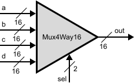
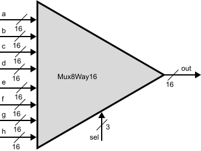
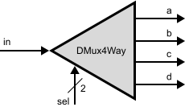
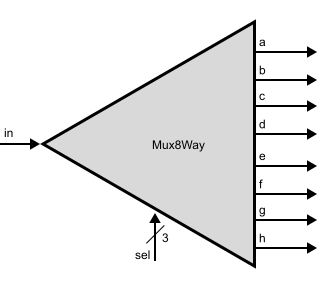

# Multi-Way Variants

## Or8Way gate

API description:

    Chip name: Or8Way
    Input: in[8]
    Output: out
    Function (JS):  if ( ( a[0]==1 ) || ( a[1]==1 ) || ( a[2]==1 ) || ( a[3]==1 ) || ( a[4]==1 ) || ( a[5]==1 ) || ( a[6]==1 ) || ( a[7]==1 )) {
                        out = 1;
                    } else {
                        out = 0;
                    }

### Construction of new Or8Way gate:

The overall construction as simple as the sequential connection of OR gates for all 8 input pins of input bus:

.svg)

Writing description in HDL code (Or8Way.hdl):

    CHIP Or8Way {
        IN in[8];
        OUT out;

    PARTS:
        Or(a=in[7], b=in[6], out=o1);
        Or(a=o1, b=in[5], out=o2);
        Or(a=o2, b=in[4], out=o3);
        Or(a=o3, b=in[3], out=o4);
        Or(a=o4, b=in[2], out=o5);
        Or(a=o5, b=in[1], out=o6);
        Or(a=o6, b=in[0], out=out);
    }

Hardware Simulator 2.5 script test to check complience with truth table for OR8WAY gate - SUCCESSFUL!

## New Or8Way gate

## Mux4Way16 gate

API description:

    Chip name: Mux4Way16
    Input: a[16], b[16], c[16], d[16], sel[2]
    Output: out[16]
    Function (JS):  if ( sel[1]==0 ) {
                        if ( sel[0]==0 ) {
                            for( let i = 0; i < 16; i++) {
							    out[i] = a[i];
						    } 
                        } else {
                            for( let i = 0; i < 16; i++) {
							    out[i] = b[i];
						    }
                        }
                    } else {
                        if ( sel[0]==0 ) {
                            for( let i = 0; i < 16; i++) {
							    out[i] = c[i];
						    }
                        } else {
                            for( let i = 0; i < 16; i++) {
							    out[i] = d[i];
						    }
                        }
                    }

Truth table for Mux4Way16 gate 
| sel[1] | sel[0] | out |
|:---:|:---:|:---:|
| 0 | 0 | a |
| 0 | 1 | b |
| 1 | 0 | c |
| 1 | 1 | d |

### Construction of new Mux4Way16 gate:

The key to construct the Mux4Way16 gate is to understand how to switch pairs of flows (a, b, c, d) according to the sel input signals. To defirentiate signals using the Mux16 gate which we constructed before we need to different values on same input. 

If we pair inputs a and b for the first Mux16 gate we have to use sel[0] as control input such we have 0 for output of flow a and 1 for output of flow b. Atherwise we can use sel[1] as control for the inputs, but then we have to pair inputs a and c or a and d to be able to defirentiate signals upon the control signal sel.

Respectively we will choose control signal sel[1] to defirentiate flows on the second stage of filtering.

.svg)

Writing description in HDL code (Mux4Way16.hdl):

    CHIP Mux4Way16 {
        IN a[16], b[16], c[16], d[16], sel[2];
        OUT out[16];
    
    PARTS:
        Mux16(a=a, b=b, sel=sel[0], out=o1);
        Mux16(a=c, b=d, sel=sel[0], out=o2);
        Mux16(a=o1, b=o2, sel=sel[1], out=out);
    }

Expression a=a or out=out means that all 16 bits of external bus a and internal bus out (Mux16 chip) goes to corresponding 16 bits of internal bus a (Mux16 chip) and external bus out.

Hardware Simulator 2.5 script test to check complience with truth table for MUX4WAY16 gate - SUCCESSFUL!

## New Mux4Way16 gate

## Mux8Way16 gate

API description:

    Chip name: Mux8Way16
    Input: a[16], b[16], c[16], d[16], e[16], f[16], g[16], h[16], sel[3]
    Output: out[16]
    Function (JS):  if ( sel[2]==0 ) {
                        if ( sel[1]==0 ) {
							    if ( sel[0]==0 ) {
                                    for( let i = 0; i < 16; i++) {
                                        out[i] = a[i];
                                    }
                                } else {
                                    for( let i = 0; i < 16; i++) {
                                        out[i] = b[i];
                                    }
						        } 
                        } else {
                            if ( sel[0]==0 ) {
                                    for( let i = 0; i < 16; i++) {
                                        out[i] = c[i];
                                    }
                                } else {
                                    for( let i = 0; i < 16; i++) {
                                        out[i] = d[i];
                                    }
						        } 
                        }
                    } else {
                        if ( sel[1]==0 ) {
							    if ( sel[0]==0 ) {
                                    for( let i = 0; i < 16; i++) {
                                        out[i] = e[i];
                                    }
                                } else {
                                    for( let i = 0; i < 16; i++) {
                                        out[i] = f[i];
                                    }
						        } 
                        } else {
                            if ( sel[0]==0 ) {
                                    for( let i = 0; i < 16; i++) {
                                        out[i] = g[i];
                                    }
                                } else {
                                    for( let i = 0; i < 16; i++) {
                                        out[i] = h[i];
                                    }
						        } 
                        }
                    }

Truth table for Mux8Way16 gate 
| sel[2] | sel[1] | sel[0] | out |
|:---:|:---:|:---:|:---:|
| 0 | 0 | 0 | a |
| 0 | 0 | 1 | b |
| 0 | 1 | 0 | c |
| 0 | 1 | 1 | d |
| 1 | 0 | 0 | e |
| 1 | 0 | 1 | f |
| 1 | 1 | 0 | g |
| 1 | 1 | 1 | h |

### Construction of new Mux4Way16 gate:

With the help of first two bits of control signal sel (sel[0] and sel[1]) we can sort out 2 of 4 flows of both set out inputs (a, b, c, d) and (e, f, g, h) by using Mux4Way16 gates. Afterwards we can sort out last two streams of data with the help of Mux16 gate and control signal sel[2].

.svg)

Writing description in HDL code (Mux8Way16.hdl):

    CHIP Mux8Way16 {
        IN a[16], b[16], c[16], d[16], e[16], f[16], g[16], h[16], sel[3];
        OUT out[16];

    PARTS:
        Mux4Way16(a=a, b=b, c=c, d=d, sel[0]=sel[0],sel[1]=sel[1], out=o1);
        Mux4Way16(a=e, b=f, c=g, d=h, sel[0]=sel[0], sel[1]=sel[1], out=o2);
	    Mux16(a=o1, b=o2, sel=sel[2], out=out);
}

Hardware Simulator 2.5 script test to check complience with truth table for MUX8WAY16 gate - SUCCESSFUL!

## New Mux8Way16 gate

## DMux4Way gate

API description:

    Chip name: DMux4Way
    Input: in, sel[2]
    Output: a, b, c, d
    Function (JS):  if ( sel[1]==0 ) {
                        if ( sel[0]==0 ) {
						    a = in;
                            b = c = d = 0;
                        } else {
                            b = in;
                            a = c = d = 0;
                        }
                    } else {
                        if ( sel[0]==0 ) {
                            c = in;
                            a = b = d = 0;
                        } else {
                            d = in;
                            a = b = c = 0;
                        }
                    }

Truth table for DMux4Way gate 
| sel[1] | sel[0] | a | b | c | d |
|:---:|:---:|:---:|:---:|:---:|:---:|
| 0 | 0 | in | 0 | 0 | 0 |
| 0 | 1 | 0 | in | 0 | 0 |
| 1 | 0 | 0 | 0 | in | 0 |
| 1 | 1 | 0 | 0 | 0 | in |

### Construction of new DMux4Way gate:

For redirection of input flow in we can use DMux gates, we constructed before. Attention needed again to the selection of the control bit on selection signal sel. Now we can redirect input in two by using last bit of selection signal sel[1] first, and then redirect two different signals again by using control signal sel[0].

.svg)

Writing description in HDL code (DMux4Way.hdl):

    CHIP DMux4Way {
        IN in, sel[2];
        OUT a, b, c, d;

    PARTS:
        DMux(in=in, sel=sel[1], a=o1, b=o2);
        DMux(in=o1, sel=sel[0], a=a, b=b);
        DMux(in=o2, sel=sel[0], a=c, b=d);
}

Hardware Simulator 2.5 script test to check complience with truth table for DMUX4WAY gate - SUCCESSFUL!

## New DMux4Way gate

## DMux8Way gate

API description:

    Chip name: Dmux8Way
    Input: in, sel[3]
    Output: a, b, c, d, e, f, g, h
    Function (JS):  if ( sel[2]==0 ) {
                        if ( sel[1]==0 ) {
						    if ( sel[0]==0 ) {
                                a = in;
                                b = c = d = e = f = g = h = 0;
                            } else {
                                b = in;
                                a = c = d = e = f = g = h = 0;
                            }
                        } else {
                            if ( sel[0]==0 ) {
                                c = in;
                                a = b = d = e = f = g = h = 0;
                            } else {
                                d = in;
                                a = b = c = e = f = g = h = 0;
                            }
                        }
                    } else {
                        if ( sel[1]==0 ) {
						    if ( sel[0]==0 ) {
                                e = in;
                                a = b = c = d = f = g = h = 0;
                            } else {
                                f = in;
                                a = b = c = d = e = g = h = 0;
                            }
                        } else {
                            if ( sel[0]==0 ) {
                                g = in;
                                a = b = c = d = e = f = h = 0;
                            } else {
                                h = in;
                                a = b = c = d = e = f = g = 0;
                            }
                        }
                    }

Truth table for DMux8Way gate 
| sel[2] | sel[1] | sel[0] | a | b | c | d | e | f | g | h |
|:---:|:---:|:---:|:---:|:---:|:---:|:---:|:---:|:---:|:---:|:---:|
| 0 | 0 | 0 | in | 0 | 0 | 0 | 0 | 0 | 0 | 0 | 
| 0 | 0 | 1 | 0 | in | 0 | 0 | 0 | 0 | 0 | 0 |
| 0 | 1 | 0 | 0 | 0 | in | 0 | 0 | 0 | 0 | 0 | 
| 0 | 1 | 1 | 0 | 0 | 0 | in | 0 | 0 | 0 | 0 |
| 1 | 0 | 0 | e | 0 | 0 | 0 | in | 0 | 0 | 0 |
| 1 | 0 | 1 | f | 0 | 0 | 0 | 0 | in | 0 | 0 |
| 1 | 1 | 0 | g | 0 | 0 | 0 | 0 | 0 | in | 0 |
| 1 | 1 | 1 | h | 0 | 0 | 0 | 0 | 0 | 0 | in |

### Construction of new DMux8Way gate:

For first redirection of input flow in we can use DMux gate and control input of sel[2]. Further we split each flow with DMux4Way gate and 2 first bits of control signal sel (sel[1] and sel[0]).

.svg)

Writing description in HDL code (DMux8Way.hdl):

    CHIP DMux8Way {
        IN in, sel[3];
        OUT a, b, c, d, e, f, g, h;

    PARTS:
        DMux(in=in, sel=sel[2], a=o1, b=o2);
        DMux4Way(in=o1, sel[1]=sel[1], sel[0]=sel[0], a=a, b=b, c=c, d=d);
        DMux4Way(in=o2, sel[1]=sel[1], sel[0]=sel[0], a=e, b=f, c=g, d=h);	
    }

Hardware Simulator 2.5 script test to check complience with truth table for DMUX8WAY gate - SUCCESSFUL!

## New DMux8Way gate

