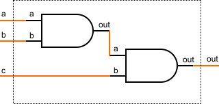
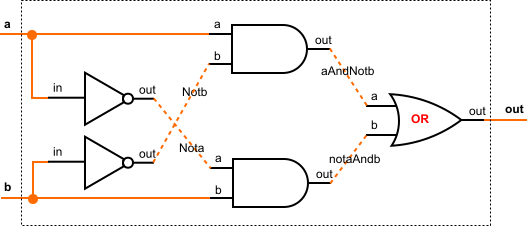
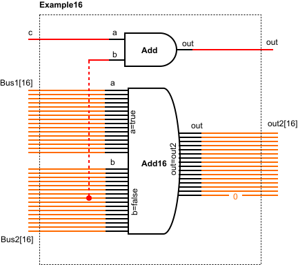

## Unit 1.1. Boolean Logic

**What is the result of 1 AND (0 OR (NOT (1)))?**

Brackets in the logical expression gives us a priority of operations, such as first operation will be 

NOT( 1 ) = 0, *Following the negation operation description [link](BooleanAlgebra.md)*

Next brackets: 0 OR 0 = 0, *Following the disjunction operation description [link](BooleanAlgebra.md)*

And final expression: 1 AND 0 = 0, *Following the conjunction operation description [link](BooleanAlgebra.md)*

Overall, we have:

> 1 AND ( 0 OR ( NOT ( 1 ) ) ) = 0

**We will now prove a part of the first De Morgan law. Suppose the inputs are x=1, y=1. What is the result of NOT(x AND y)?**

Let's write the equation with the given x and y:

NOT (1 AND 1)

1 AND 1 = 1, *Following the conjunction operation description [link](BooleanAlgebra.md)*

and NOT( 1 ) = 0, *Following the negation operation description [link](BooleanAlgebra.md)*

Overall, we have:

> NOT ( 1 AND 1 ) = 0

## Unit 1.2. Boolean Functions Synthesis

| *x* | *y* | *z* | *f* |
|:---:|:---:|:---:|:---:|
| 0 | 0 | 0 | 1 |
| 0 | 0 | 1 | 0 |
| 0 | 1 | 0 | 1 |
| 0 | 1 | 1 | 0 |
| 1 | 0 | 0 | 1 |
| 1 | 0 | 1 | 0 |
| 1 | 1 | 0 | 0 |
| 1 | 1 | 1 | 0 |

**( NOT( x ) AND NOT( y ) AND NOT( z ) ) OR** 
**( NOT( x ) AND y AND NOT( z )) OR**
**( x AND NOT( y ) AND NOT( z ))**

**Suppose the second row in the truth table (x=0, y=0, z=1) also had a value of f=1.** 

**What would you add to the boolean expression?** 

As soon as we write down logical equivalents for the lines of truth table where function parameter **f** equals 1, we can write down second line as follows (if value of the parameter equals 1 - we write down parameter, if value of the parameter equals 0 - we write NOT( parameter ); parameters are combined with the help of AND operator):

NOT( x ) AND NOT( y ) AND z

And to incorporate this equivalent into overall logical equivalent of the truth table we have to add this statement to the rest of the statements with the help of OR operator:

> OR ( NOT( x ) AND NOT( y ) AND z )

**What would be the logical equivalent of NAND(x,x)?** 

**Remember NAND(x,x) is defined to be NOT(x AND x). Here is the truth table.**

| *x* | *y* | NAND |
|:---:|:---:|:---:|
| 0 | 0 | 1 | 
| 0 | 1 | 1 | 
| 1 | 0 | 1 | 
| 1 | 1 | 0 | 

We can use the monotone law of idempotence of conjucntion operation AND: x AND x = x, [link](BooleanAlgebra.md)

And such: 

>NAND( x, x ) = NOT( x AND x ) = NOT( x ) 

## Unit 1.3. Logic Gates

**Does the order of the input bits in this implementation matter?**

Let's write down the logical equivalent for the scheme:

( a AND b ) AND c 

Following the monotone law of associativity of conjunction operation AND: x AND ( y AND z ) = ( x AND y ) AND z, [link](BooleanAlgebra.md) 

We can write the following:

>( a AND b ) AND c = a AND ( b AND c ) 

Which means that it doesn't matter if we would change the order of the input bits, the result would be exactly the same.

## Unit 1.3. Logic Gates

| a | b | out |
|:---:|:---:|:---:|
| 0 | 0 | 0 | 
| 0 | 1 | 1 | 
| 1 | 0 | 1 | 
| 1 | 1 | 0 | 

**Which of these statements are true?**

* **The Xor gate outputs 1 if and only if its two input bits are unequal.**

>TRUE statement which easily proven by the truth table (lines 2 and 3). 

* **The Xor gate’s output differs from the And gate's output on all possible inputs.**

Truth table for conjunction operation AND:
| *x* | *y* | *x* AND *y* |
|:---:|:---:|:---:|
| 0 | 0 | 0 |
| 0 | 1 | 0 |
| 1 | 0 | 0 |
| 1 | 1 | 1 |

> NOT TRUE statement which easily proven with the comparison of the truth tables (line 1 is different in each table)

* **The Xor gate outputs 0 if and only if the sum of the input bits is an even number.**

| a | b | a + b (decimal) | a + b (binary) |
|:---:|:---:|:---:|:---:|
| 0 | 0 | 0 | 0 |
| 0 | 1 | 1 | 1 |
| 1 | 0 | 1 | 1 |
| 1 | 1 | 2 | 10 |

> TRUE statement which is easily proven by calculating summ of the bits (see table). 0 and 2 (10) are even numbers.

* **The Xor gate’s output differs from the Or gate's output only on the input a=1, b=1.**

Truth table for disjunction operation OR: 

| *x* | *y* | *x* OR *y* |
|:---:|:---:|:---:|
| 0 | 0 | 0 |
| 0 | 1 | 1 |
| 1 | 0 | 1 |
| 1 | 1 | 1 |

> TRUE statement which is easily proven by comparing the line 4 of each table.

## Unit 1.4. Hardware Description

**How would you implement the red chip (rightmost part of the diagram) in HDL?**

Just follow the names of the intake pins of the OR gate and names of the contacts which connects them.

For the a port of the OR gate we have the out port of the AND gate with the assigned name of aAndNotb

For the b port of the OR gate we have the out port of the AND gate with the assigned name of notaAndb

For the out port of OR gate we have standard out port of the whole chip

Thus the syntax of HDL language for the OR gate will be *GateName(a=[input port connection name], b=[input port connection name], out=[output port connection name])*

> OR( a = aAndNotb, b = notaAndb, out = out)

## Unit 1.6. Multi-Bit Buses

**How would you xor the first and last bits of a 16-bit bus named ‘bus’?**

We have to remember that in Hardware Simulator 2.5 16-bit bus would be represented as the array with length of 16 elements. Same as in most of programming languages (JS) array of 16 elements (bus[16]) starts with [0] element and thus the last element would be [15].

Following the same syntax described above (for gate element) we can write (remember that XOR gate has only 2 inputs {a, b} and one output element {out}, though bus element has 16 elements output {bus[0..15]}):

>XOR( a = bus[0], b = [15], out = out)

**This is the interface declaration for an example chip named Example16, which we haven't discussed before:**

**IN c, Bus1[16], Bus2[16];**

**OUT out, out2[16];**

**Which of these lines are valid in HDL, when implementing the Example16 chip?**

Following is the scheme of Example16 chip with all the valid connections.

Thus the valid declarations would be:

>Add16( a = Bus1[0..15], b = Bus2[0..15], out[0..14] = out2[0..14]); 

Orange connection. On output port of Add16 chip pins from 1 to 15 (out[0..14]) will have a value of 1 and pin 16 (out[15]) will have value of 0 by default (because no data was assigned to the pin).

>Add16( a = true, b = false, out = out2 );

Black connection. By the syntax a = true means that all the pins on the input port a will have the same value of 1. Same, by the syntax b = false means that all the pins on the input port b will have the same value of 0. Output of Add16 chip has the same 16 bit-length as the output of the Example16 chip.

>And( a = c, b = Bus2[7], out = out);

Red connection. Input port a of chip Add and input port c of chip Example16 both are 1 bit-length ports. Input port b of chip Add connects with pin 8 Bus1[7] of the input bus Bus1[16]. Output port out of chip Add and output port out of chip Example16 are both 1 bit-length ports.